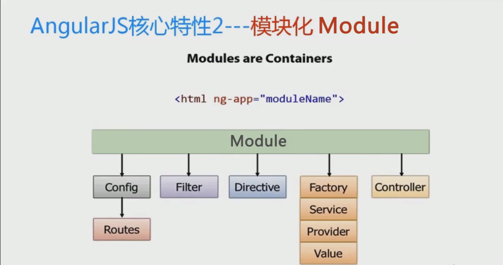
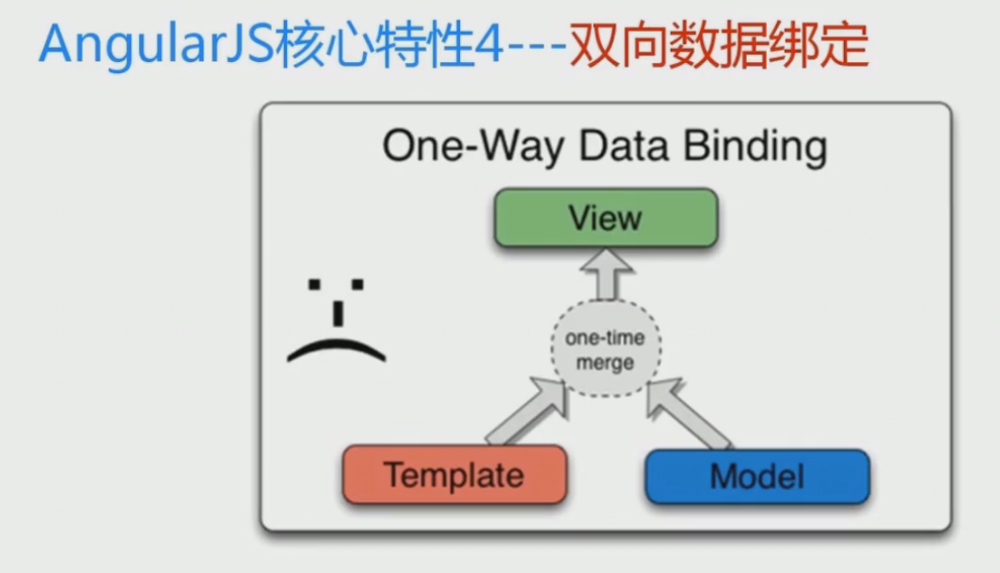

第一节  快速上手

四大核心特性:
* MVC
* 模块化
* 指令系统
* 双向该数据绑定  

 1 MVC

 2 模块化

3 指令系统

4 双向数据绑定

常见的开发工具:

* 代码编辑工具: atom  sublime
* 断点调试工具: chrome插件:batarang
* 版本管理工具: git 小乌龟git
* 开发和调试工具: node.js
* 代码合并和混淆工具: grunt,相应插件:
  * grunt-contrib-uglify   对代码进行混淆
  * grunt-contrib-concat  对代码进行合并
  * grunt-contrib-watch   监听代码变化
* 依赖管理工具: bower
  * 自动安装依赖的组件,组件之间的依赖检测,版本兼容性自动检测 http:bower.io,使用node进行安装
* 轻量级Server: http-server
  * 一款简单的http-server 基于nodejs的http接口
  * 使用node进行安装
* 单元测试: karma,  jasmine:单元测试工具
  * 分组
  * 用例
  * 期望
  * 匹配
  * 使用node进行安装
* 专门为angularjs 定制的测试工具: Protractor
  *
